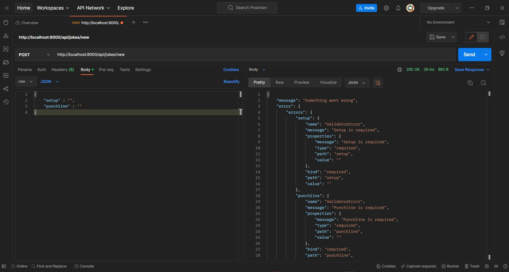
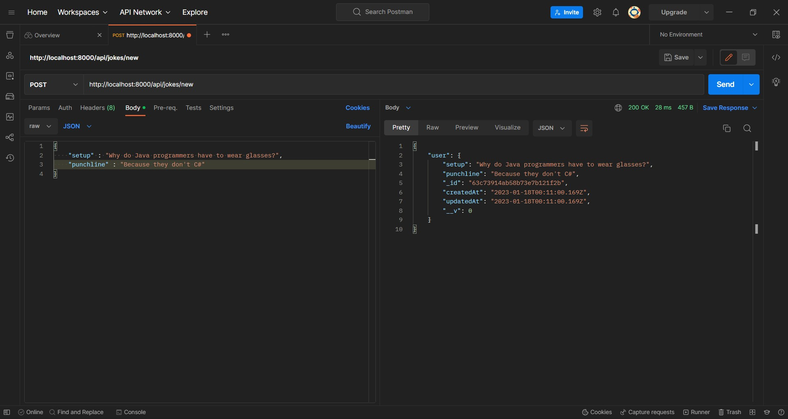
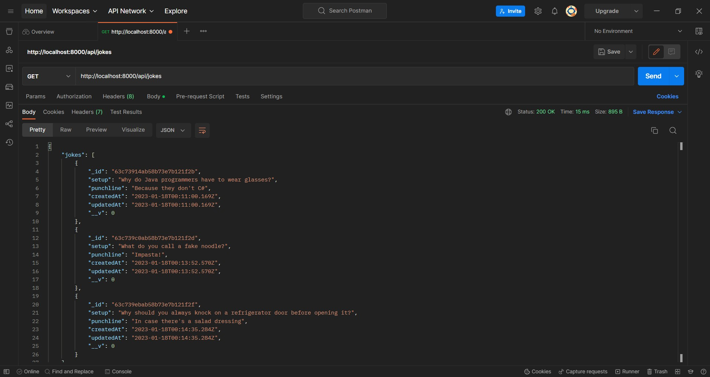
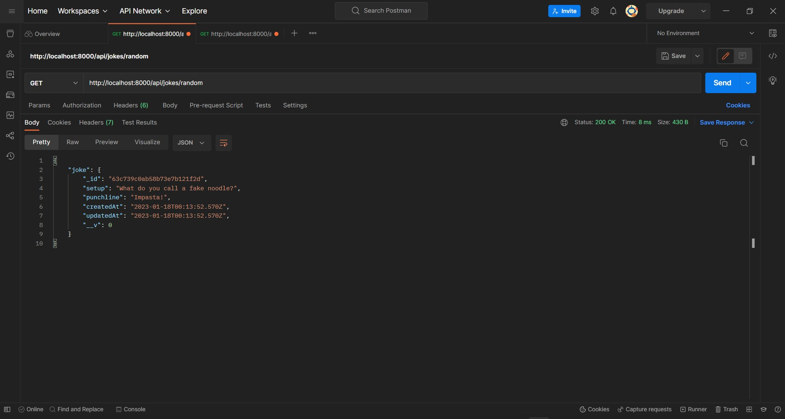
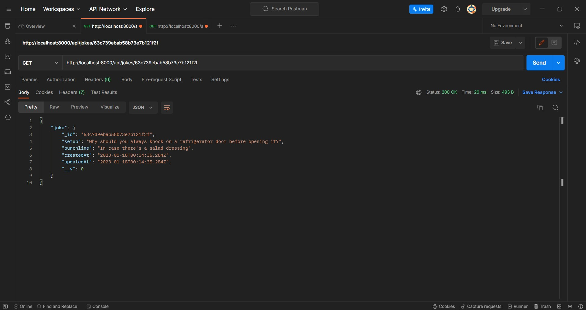
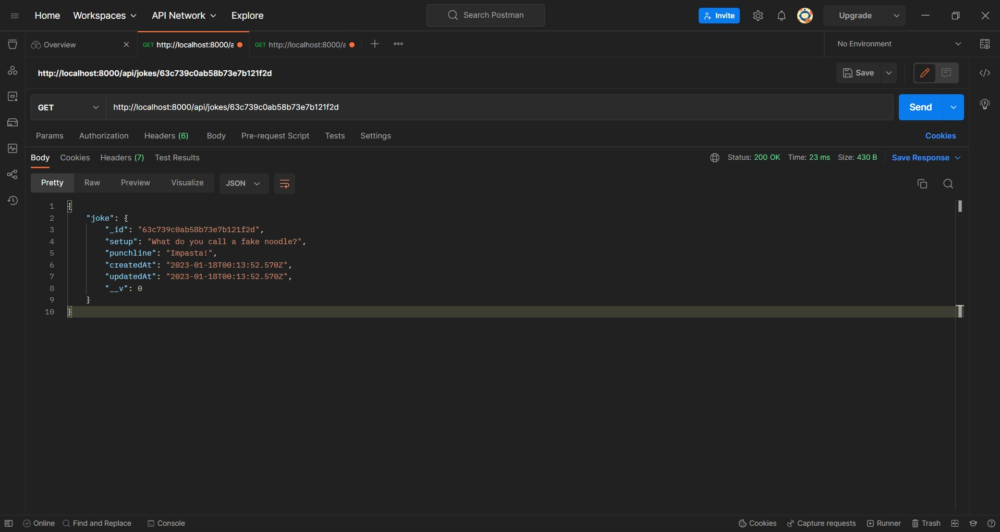
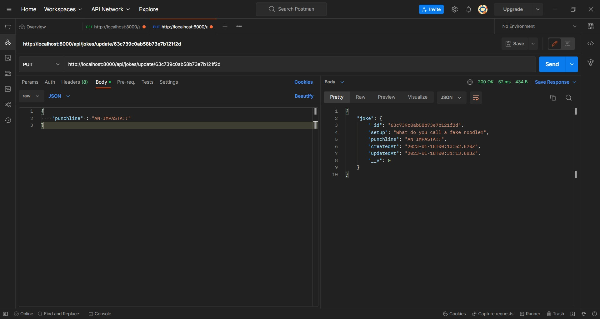
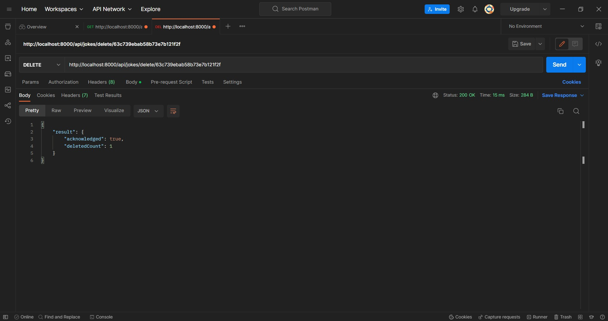

# API Jokes
Creando API de bromas

## Create a new joke:
`/api/jokes/new` 

-> Create new empty joke (Errors)

-> Create new joke

## Returns a list of all jokes:
`/api/jokes` 

## Returns a random joke:
`/api/jokes/random` 

## Returns the joke with matching "_id":
`/api/jokes/:id` 

## Updates the joke with matching "_id":
`/api/jokes/update/:id` 

-> Before updating

->After updating

## Removes the joke with matching "_id":
`/api/jokes/delete/:id` 

